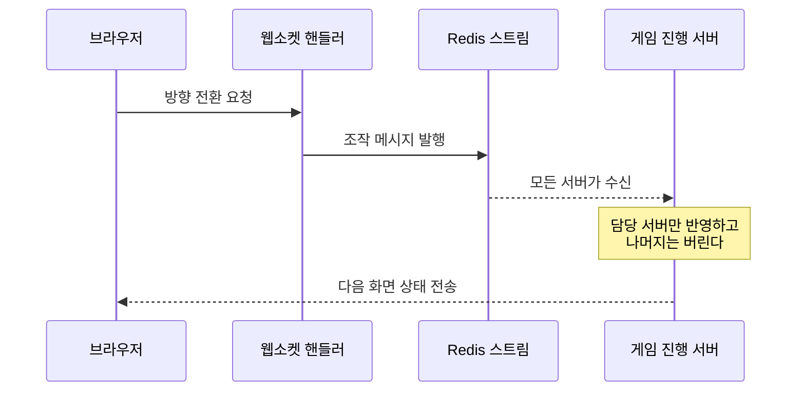

# create-pr 작성 예시

[SKILL.md](SKILL.md)에서 분리한 type별 제목·본문 예시 모음이다. 메인 스킬 파일은 규칙만 담고, 구체 예시는 이 파일에서 관리한다.

## type별 제목 예시

영역 라벨(`BE`/`FE`)은 변경 경로로 판별해 type 라벨과 함께 단다(SKILL.md "라벨 & Assignee" 참조). 아래 예시의 영역 라벨은 백엔드 변경 가정이다.

| type | 라벨 예시 | 제목 예시 |
|------|------|-----------|
| feat | `✨feat`, `BE` | `[feat] 친구 초대 알림 Redis Stream 발행 추가` |
| fix | `🐞bug`, `BE` | `[fix] 카드 점수 집계 누락 수정` |
| refactor | `🛠️refactor`, `BE` | `[refactor] Room-GameSession 책임 분리` |
| chore | `⚙️chore`, `BE` | `[chore] Testcontainers reuse 재활성화` |
| docs | `📝docs`, `BE` | `[docs] ADR-0020 작성` |
| test | `🧪 test`, `BE` | `[test] 카드 점수 집계 회귀 테스트 추가` |

## 본문 작성 예시

본문 전체는 **무엇이 달라지는가 → 왜 바꿨는가 → 어떻게 검증했는가 → 이번에 하지 않은 것** 순서로 흐른다. 이 순서를 템플릿 섹션에 얹으면 아래 예시가 된다.

### 예시 1 — 흐름이 안 바뀌는 수정 (그림 없음)

버그 하나를 고치는 PR이다. 컴포넌트 사이 흐름이 그대로라서 그림을 넣지 않았다.

````text
# ✅ 체크리스트

- [x] merge 타겟 브랜치 잘 설정되었는지 확인하기 (dev)

# 🔥 연관 이슈

- close #1404

# 🚀 작업 내용

게임이 끝났을 때 최종 순위가 실제 플레이 결과와 맞게 나옵니다.

지금은 마지막 라운드 점수가 집계에서 빠집니다. 점수를 합치는 반복문이 마지막 라운드 직전까지만 돌기 때문입니다. 3라운드 게임을 하면 3라운드에서 아무리 잘해도 순위가 바뀌지 않습니다.

1. 점수를 합칠 때 마지막 라운드가 빠지던 범위 계산을 고쳤습니다. 경계 조건만 바꾸지 않고 범위 계산 자체를 고친 이유는 아래 리뷰 중점사항에 적었습니다.
   파일: `ScoreBoard#aggregate`
2. 같은 실수가 다시 나면 바로 실패하도록 회귀 테스트를 먼저 추가했습니다. 3라운드 게임에서 3라운드 점수가 반영되는지 봅니다.
   파일: `ScoreBoardTest`

검증: `:game:test --tests '*ScoreBoardTest'` 4개 전부 통과했습니다. 수정 전 코드에서는 새로 추가한 테스트 1개가 실패하는 것을 먼저 확인했습니다.

# 💬 리뷰 중점사항

- 경계 조건을 `<`에서 `<=`로 바꾸는 대신 범위 계산 자체를 고쳤습니다. 다른 호출부인 `RoundResult`가 같은 범위 계산을 쓰고 있어서, 한쪽만 고치면 두 곳의 결과가 어긋납니다.

# 🙅 이번에 하지 않은 것

- 순위 표시 화면은 건드리지 않았습니다. 집계 결과만 고치면 화면은 그대로 맞게 나옵니다.
````

### 예시 2 — 흐름이 바뀌는 기능 (mermaid 1개)

요청이 여러 컴포넌트를 새로 거치게 되는 PR이다. 클래스 이름을 나열하는 대신 그림 하나로 보여준다.

````text
# 🚀 작업 내용

플레이어가 방향을 꺾으면 그 조작이 게임을 실제로 돌리고 있는 서버 한 대에만 전달됩니다. 서버가 여러 대여도 조작이 사라지거나 두 번 반영되지 않습니다.

지금은 조작을 받은 서버가 그 자리에서 처리합니다. 그런데 요청을 받는 서버와 게임을 돌리는 서버가 항상 같지는 않습니다. 다른 서버가 요청을 받으면 그 조작은 그냥 버려집니다.



1. 조작을 웹소켓에서 바로 처리하지 않고 Redis 스트림에 흘려보냅니다. 요청을 받은 서버와 게임을 돌리는 서버가 다를 수 있기 때문입니다.
   파일: `WormGameCommandPublisher`
2. 스트림은 모든 서버가 같이 받으므로, 담당이 아닌 서버는 조용히 버립니다. 로그를 남기지 않는 이유는 이 판단이 매 틱마다 일어나기 때문입니다.
   파일: `SteerCommandEventConsumer`
3. 화면 갱신 메시지는 재접속 복구용으로 저장하지 않고 그때만 보냅니다. 초당 20번 나가는 메시지를 저장하면 Redis 왕복이 그만큼 늘어납니다.
   파일: `LoggingSimpMessagingTemplate#convertAndSendTransient`

<details>
<summary>물리 상수와 그 근거</summary>

회전 상한 `ω = 200°/s × (v/120)^0.7` 등 수치의 근거는 [설계 문서 v0.3](링크)에 있습니다.

</details>

검증: `WormGameServiceTest`와 `SteerCommandEventConsumerTest` 포함 27개가 전부 통과했습니다. 서버 두 대를 로컬로 띄워 담당이 아닌 쪽이 조작을 버리는 것도 직접 확인했습니다.

# 💬 리뷰 중점사항

- 조작을 스트림에 태우면 반영이 한 틱만큼 늦어집니다. 반응 속도보다 서버가 여러 대일 때의 정확성을 택했는데, 이 판단이 맞는지 봐주세요.

# 🙅 이번에 하지 않은 것

- 스트림에 쌓인 조작 메시지의 보관 기간은 기본값 그대로 뒀습니다. 실제 트래픽을 보고 정하는 편이 낫다고 판단했습니다.
- 프론트엔드 연동은 다음 단계로 미뤘습니다.
````

## 정보 결합도 대조 — 같은 내용, 다른 읽힘

실제로 나왔던 문장이다. 왼쪽은 사실이 다 들어 있지만 한 번에 안 읽힌다. 서로 다른 정보가 괄호와 화살표로 한 문장에 묶여 있기 때문이다.

| 이렇게 쓰지 않는다 | 이렇게 쓴다 |
| --- | --- |
| **infra** — Stream 경유 조향 (`SteerCommand` → `WormGameCommandPublisher` → `[wormgame]` 스트림(max-length 1000) → `SteerCommandEventConsumer`: **비소유 인스턴스 무로그 스킵**) | 조작을 Redis 스트림으로 보냅니다. 요청을 받은 서버와 게임을 돌리는 서버가 다를 수 있기 때문입니다. 담당이 아닌 서버는 조용히 버립니다.<br>파일: `WormGameCommandPublisher`, `SteerCommandEventConsumer` |
| **틱 단일 시간축** — 이동·반지름·점수·사망 시각 전부 tick 유도, 벽시계 미사용 | 시간이 필요한 계산은 전부 틱 번호로 합니다. 서버 시계를 보지 않으므로 어느 서버에서 돌려도 결과가 같습니다. |
| 델타·스냅샷은 `convertAndSendTransient` = **복구 저장 제외**, state는 저장 유지 | 화면 갱신 메시지는 저장하지 않고 그때만 보냅니다. 게임 상태 메시지는 재접속 복구에 필요하니 그대로 저장합니다. |

세 줄 다 길어졌다. 대신 되읽을 필요가 없어졌다. 정보 결합도를 낮춘다는 건 이런 뜻이다.

연관 이슈가 없으면 `🔥 연관 이슈` 항목에 `없음`을 적고 사유를 괄호로 덧붙인다(예: `없음 (경량 경로)`).
